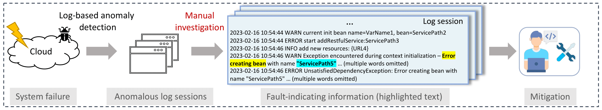

# Demystifying and Extracting Fault-indicating Information from Logs for Failure Diagnosis

This is the public repository for our paper **"Demystifying and Extracting Fault-indicating Information from Logs for Failure Diagnosis"** accepted by ISSRE 2024. 
In this paper, we propose an automated approach to extract fault-indicating information from logs.



## Repository Structure
```
.
├── data
│   ├── Apache
│   │   ├── train.json
│   │   ├── dev.json
│   │   ├── test.json
│   ├── Industry-clean
│   │   ├── train.json
│   │   ├── dev.json
│   │   ├── test.json
├── src
│   ├── pipeline.py
│   ├── config
│   │   ├── config.py
│   ├── preprocessing
│   │   ├── preprocessing.py
│   ├── log_selection
│   │   ├── selection_strategy.py
│   │   ├── textual_encoding.py
│   │   ├── textual_similarity.py
│   ├── llm_inference
│   │   ├── run_qa.py
│   │   ├── args.py
│   │   ├── dataset.py
│   │   ├── trainer_qa.py
│   │   ├── utils_qa.py
│   ├── evaluation
│   │   ├── evaluate.py
│   │   ├── my_squad_v2.py
│   │   ├── my_evaluator.py
│   ├── prerained_models
│   │   ├── roberta-base
│   │   │   ├── download.sh 
│   │   ├── unixcoder-base
│   │   │   ├── download.sh 
```

## Quick Start
- Install Requirements

```
conda create -n lofi python=3.9
conda activate lofi
pip install -r requirements.txt
```

- Download Pretrained Language Models

```
cd src/pretrained_models/unixcoder-base
bash download.sh
```

- Run Pipeline Stage 1: Log Selection 
```
cd src
CUDA_VISIBLE_DEVICES=0 python pipeline.py --log_selection --training_data_dir ../data/Apache
```

- Run Pipeline Stage 2: PLM Training and Inference
```
cd src
CUDA_VISIBLE_DEVICES=0 python pipeline.py --do_extraction --training_data_dir ../data/Apache
```

You can also evaluate the performance of Industry dataset by replacing `--training_data_dir ../data/Apache ` to `--training_data_dir ../data/Industry-clean`.

### Dataset

The dataset is available at `./data/Apache` and `./data/Industry-clean`.
In this repository, we provide an anonymized dataset with confidential information removed.

